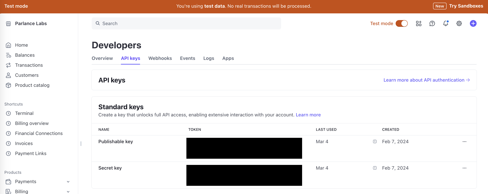
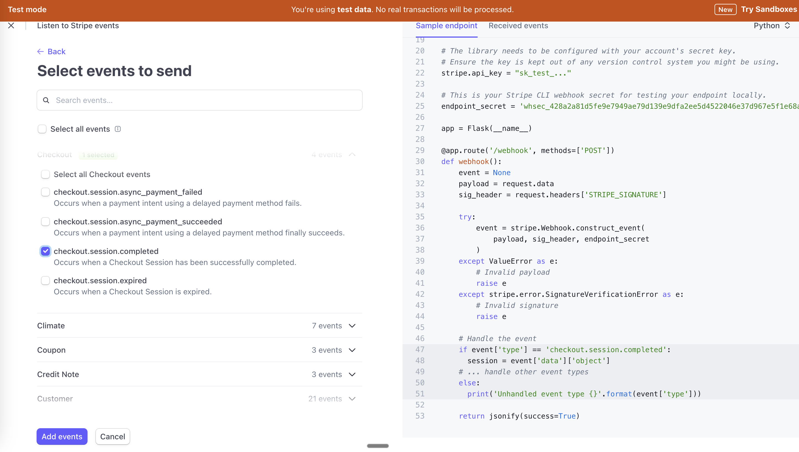
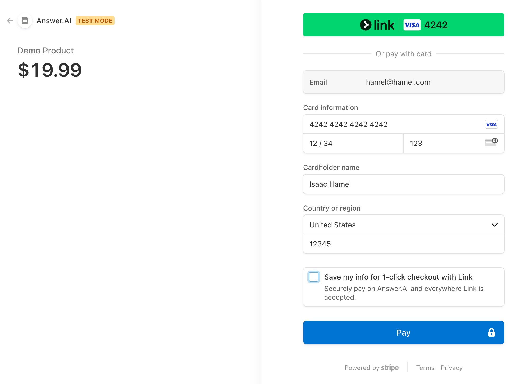

# Stripe


<!-- WARNING: THIS FILE WAS AUTOGENERATED! DO NOT EDIT! -->

This guide will walk through a minimal example of working with a Stripe
one-time payment link and webhook for secure reconciliation of payments.

To get started we can import the stripe library and authenticate with a
**Stripe API key** that you can get from the stripe web UI.

<details open class="code-fold">
<summary>Exported source</summary>

``` python
from fasthtml.common import *
import os
```

</details>

## Stripe Authentication

You can install stripe python sdk directly from pypi:

``` sh
pip install stripe
```

Additionally, you need to install the stripe cli. You can find how to
install it on your specific system in their docs
[here](https://docs.stripe.com/get-started/development-environment?lang=python#setup-cli)

``` python
# uncomment and execute if needed
#!pip install stripe
```

<details open class="code-fold">
<summary>Exported source</summary>

``` python
import stripe
```

</details>

<details open class="code-fold">
<summary>Exported source</summary>

``` python
stripe.api_key = os.environ.get("STRIPE_SECRET_KEY")
DOMAIN_URL = os.environ.get("DOMAIN_URL", "http://localhost:5001")
```

</details>

You can get this API key from the Stripe Dashboard by going to [this
url](https://dashboard.stripe.com/test/apikeys).

<div>

> **Note**
>
> Note: Make sure you have `Test mode` turned on in the dashboard.

</div>



Make sure you are using a test key for this tutorial

``` python
assert 'test_' in stripe.api_key
```

## Pre-app setup

<div>

> **Tip**
>
> Everything in the pre-app setup sections is a run once and not to be
> included in your web-app.

</div>

### Create a product

You can run this to programatically create a Stripe **Product** with a
**Price**. Typically, this is not something you do dynamically in your
FastHTML app, but rather something you set up one time. You can also
optionally do this on the Stripe Dashboard UI.

<details open class="code-fold">
<summary>Exported source</summary>

``` python
def _search_app(app_nm:str, limit=1): 
    "Checks for product based on app_nm and returns the product if it exists"
    return stripe.Product.search(query=f"name:'{app_nm}' AND active:'True'", limit=limit).data

def create_price(app_nm:str, amt:int, currency="usd") -> list[stripe.Price]:
    "Create a product and bind it to a price object. If product already exist just return the price list."
    existing_product = _search_app(app_nm)
    if existing_product: 
        return stripe.Price.list(product=existing_product[0].id).data
    else:
        product = stripe.Product.create(name=f"{app_nm}")
        return [stripe.Price.create(product=product.id, unit_amount=amt, currency=currency)]

def archive_price(app_nm:str):
    "Archive a price - useful for cleanup if testing."
    existing_products = _search_app(app_nm, limit=50)
    for product in existing_products:
        for price in stripe.Price.list(product=product.id).data: 
            stripe.Price.modify(price.id, active=False)
        stripe.Product.modify(product.id, active=False)
```

</details>

<div>

> **Tip**
>
> To do recurring payment, you would use
> `recurring={"interval": "year"}` or `recurring={"interval": "month"}`
> when creating your stripe price.

</div>

<details open class="code-fold">
<summary>Exported source</summary>

``` python
app_nm = "[FastHTML Docs] Demo Product"
price_list = create_price(app_nm, amt=1999)
assert len(price_list) == 1, 'For this tutorial, we only have one price bound to our product.'
price = price_list[0]
```

</details>

``` python
print(f"Price ID = {price.id}")
```

    Price ID = price_1R1ZzcFrdmWPkpOp9M28ykjy

### Create a webook

A webhook is simply a URL where your app listens for messages from
Stripe. It provides a way for Stripe, the payment processor, to notify
your application when something happens with a payment. Think of it like
a delivery notification: when a customer completes a payment, Stripe
needs to tell your application so you can update your records, send
confirmation emails, or provide access to purchased content. It is
simply a URL,

But your app needs to be sure every webhook event is actually coming
from Stripe. That is, it needs to authenticate the notification. To do
that, your app will need a **webhook signing secret**, which it uses to
confirm that the notifications were signed by Stripe.

This secret is different from your Stripe API key. The Stripe API key
lets you prove who you are to Stripe. The webhook signing secret lets
you be sure messages from Stripe are coming from Stripe.

You will need a webhook signing secret whether your app is is running
locally in test mode, or whether it is a real production app on running
on a server. Here is how you get the webhook signing secret in these two
cases.

#### Local Webhook

When your application runs locally during development it can be reached
only from your computer, so Stripe can’t make an HTTP request against
the webhook. To workaround this in development, the Stripe CLI tool
creates a secure tunnel which forwards these webhook notifications from
Stripe’s servers to your local application.

Run this command to start that tunnel:

``` bash
stripe listen --forward-to http://localhost:5001/webhook
```

On success, that command will also tell you the webhook signing secret.
Take the secret it gives you and set it as an environment variable.

``` bash
export STRIPE_LOCAL_TEST_WEBHOOK_SECRET=<your-secret>
```

#### Production Webhook

For a deployed app, you configure a permanent webhook connection in your
Stripe Dashboard. This establishes an official notification channel
where Stripe will send real-time updates about payments to your
application’s `/webhook` URL.

On the dashboard, you can configure which specific payment event
notifications will go to this webhook (e.g., completed checkouts,
successful payments, failed payments, etc..). Your app provides the
webhook signing secret to the Stripe library, to authenticate that these
notifications come from the Stripe service. This is essential for
production environments where your app needs to automatically respond to
payment activities without manual intervention.

To configure the permanent webhook connection, you need to do the
following steps:

1.  Make sure you are in Test mode like before

2.  Go to https://dashboard.stripe.com/test/webhooks

3.  Click “+ Add endpoint” to create create a new webhook (or, if that
    is missing, click “Create an event destination”).

4.  On the primary screen shown below, “Listen to Stripe events”, fill
    out the details. Your Endpoint URL will be
    `https://YOURDOMAIN/webhook`

5.  Save your webhook signing scret. On the “Listen to Stripe events”
    screen, you can find it in the app sample code on the right hand
    side as the “endpoint secret”. You can also retrieve it later from
    the dashboard.


You also need to configure which events should generate webhook
notifications:

1.  Click “+ Select events” to open the secondary control screen,
    “Select events to send”, which is shown below. In on our case we
    want to listen for `checkout.session.completed`.

2.  Click the “Add Events” button, to confirm which events to send.



<div>

> **Tip**
>
> For subscriptions you may also want to enable additional events for
> your webhook such as: `customer.subscription.created`,
> `customer.subscription.deleted`, and others based on your use-case.
>
> 

</div>

Finally, click “Add Endpoint”, to finish configuring the endpoint.

## App

<div>

> **Tip**
>
> Everything after this point is going to be included in your actual
> application. The application created in this tutorial can be found
> [here](https://github.com/AnswerDotAI/fasthtml/blob/main/nbs/explains/stripe_otp.py)

</div>

### Setup to have the right information

In order to accept a payment, you need to know who is making the
payment.

There are many ways to accomplish this, for example using
[oauth](https://github.com/AnswerDotAI/fasthtml/blob/main/nbs/explains/oauth.ipynb)
or a form. For this example we will start by hardcoding an email address
into a session to simulate what it would look like with oauth.

We save the email address into the session object, under the key `auth`.
By putting this logic into beforeware, which runs before every request
is processed, we ensure that every route handler will be able to read
that address from the session object.

<details open class="code-fold">
<summary>Exported source</summary>

``` python
def before(sess): sess['auth'] = 'hamel@hamel.com'
bware = Beforeware(before, skip=['/webhook'])
app, rt = fast_app(before=bware)
```

</details>

We will need our webhook secret that was created. For this tutorial, we
will be using the local development environment variable that was
created above. For your deployed production environment, you will need
to get the secret for your webhook from the Stripe Dashboard.

<details open class="code-fold">
<summary>Exported source</summary>

``` python
WEBHOOK_SECRET = os.getenv("STRIPE_LOCAL_TEST_WEBHOOK_SECRET")
```

</details>

### Payment Setup

We need 2 things first:

1.  A button for users to click to pay
2.  A route that gives stripe the information it needs to process the
    payment

<details open class="code-fold">
<summary>Exported source</summary>

``` python
@rt("/")
def home(sess):
    auth = sess['auth']
    return Titled(
        "Buy Now", 
        Div(H2("Demo Product - $19.99"),
            P(f"Welcome, {auth}"),
            Button("Buy Now", hx_post="/create-checkout-session", hx_swap="none"),
            A("View Account", href="/account")))
```

</details>

We are only allowing card payments (`payment_method_types=['card']`).
For additional options see the [Stripe docs](https://docs.stripe.com/).

<details open class="code-fold">
<summary>Exported source</summary>

``` python
@rt("/create-checkout-session", methods=["POST"])
async def create_checkout_session(sess):
    checkout_session = stripe.checkout.Session.create(
        line_items=[{'price': price.id, 'quantity': 1}],
        mode='payment',
        payment_method_types=['card'],
        customer_email=sess['auth'],
        metadata={'app_name': app_nm, 
                  'AnyOther': 'Metadata',},
        # CHECKOUT_SESSION_ID is a special variable Stripe fills in for you
        success_url=DOMAIN_URL + '/success?checkout_sid={CHECKOUT_SESSION_ID}',
        cancel_url=DOMAIN_URL + '/cancel')
    return Redirect(checkout_session.url)
```

</details>

<div>

> **Tip**
>
> For subscriptions the mode would typically be `subscription` instead
> of `payment`

</div>

This section creates two key components: a simple webpage with a “Buy
Now” button, and a function that handles what happens when that button
is clicked.

When a customer clicks “Buy Now,” the app creates a Stripe checkout
session (essentially a payment page) with product details, price, and
customer information. Stripe then takes over the payment process,
showing the customer a secure payment form. After payment is completed
or canceled, Stripe redirects the customer back to your app using the
success or cancel URLs you specified. This approach keeps sensitive
payment details off your server, as Stripe handles the actual
transaction.

### Post-Payment Processing

After a customer initiates payment, there are two parallel processes:

1.  **User Experience Flow**: The customer is redirected to Stripe’s
    checkout page, completes payment, and is then redirected back to
    your application (either the success or cancel page).

2.  **Backend Processing Flow**: Stripe sends webhook notifications to
    your server about payment events, allowing your application to
    update records, provision access, or trigger other business logic.

This dual-track approach ensures both a smooth user experience and
reliable payment processing.

The webhook notification is critical as it’s a reliable way to confirm
payment completion.

#### Backend Processing Flow

Create a database schema with the information you’d like to store.

<details open class="code-fold">
<summary>Exported source</summary>

``` python
# Database Table
class Payment:
    checkout_session_id: str  # Stripe checkout session ID (primary key)
    email: str
    amount: int  # Amount paid in cents
    payment_status: str  # paid, pending, failed
    created_at: int # Unix timestamp
    metadata: str  # Additional payment metadata as JSON
```

</details>

Connect to the database

<details open class="code-fold">
<summary>Exported source</summary>

``` python
db = Database("stripe_payments.db")
payments = db.create(Payment, pk='checkout_session_id', transform=True)
```

</details>

In our webhook we can execute any business logic and database updating
we need to.

<details open class="code-fold">
<summary>Exported source</summary>

``` python
@rt("/webhook")
async def post(req):
    payload = await req.body()
    # Verify the event came from Stripe
    try:
        event = stripe.Webhook.construct_event(
            payload, req.headers.get("stripe-signature"), WEBHOOK_SECRET)
    except Exception as e:
        print(f"Webhook error: {e}")
        return
    if event and event.type == "checkout.session.completed":
        event_data = event.data.object
        if event_data.metadata.get('app_name') == app_nm:
            payment = Payment(
                checkout_session_id=event_data.id,
                email=event_data.customer_email,
                amount=event_data.amount_total,
                payment_status=event_data.payment_status,
                created_at=event_data.created,
                metadata=str(event_data.metadata))
            payments.insert(payment)
            print(f"Payment recorded for user: {event_data.customer_email}")
            
    # Do not worry about refunds yet, we will cover how to do this later in the tutorial
    elif event and event.type == "charge.refunded":
        event_data = event.data.object
        payment_intent_id = event_data.payment_intent
        sessions = stripe.checkout.Session.list(payment_intent=payment_intent_id)
        if sessions and sessions.data:
            checkout_sid = sessions.data[0].id
            payments.update(Payment(checkout_session_id= checkout_sid, payment_status="refunded"))
            print(f"Refund recorded for payment: {checkout_sid}")
```

</details>

The webhook route is where Stripe sends automated notifications about
payment events. When a payment is completed, Stripe sends a secure
notification to this endpoint. The code verifies this notification is
legitimate using the webhook secret, then processes the event data -
extracting information like the customer’s email and payment status.
This allows your application to automatically update user accounts,
trigger fulfillment processes, or record transaction details without
manual intervention.

Note that in this route, our code extracts the user’s email address from
the Stripe event, *not from the session object*. That is the because
this route will be hit by a request from Stripe’s servers, not from the
user’s browser.

<div>

> **Tip**
>
> When doing a subscription, often you would add additional event types
> in an if statement to update your database appropriately with the
> subscription status.
>
> ``` python
> if event.type == "payment_intent.succeeded":
>     ...
> elif event.type == "customer.subscription.created":
>     ...
> elif event.type == "customer.subscription.deleted":
>     ...
> ```

</div>

#### User Experience Flow

The `/success` route is where Stripe will redirect the user *after* the
payment completes successfully, which will also be after Stripe has
called the webhook to inform your app of the transaction.

Stripe knows to send the user here, because you provided Stripe with
this route when you created a checkout session.

But you want to verify this is the case. So in this route, you should
verify the user’s payment status, by checking your database for the
entry which your app saved when it received that webhook notification.

<details open class="code-fold">
<summary>Exported source</summary>

``` python
@rt("/success")
def success(sess, checkout_sid:str):    
    # Get payment record from database (saved in the webhook)
    payment = payments[checkout_sid]

    if not payment or payment.payment_status != 'paid': 
        return Titled("Error", P("Payment not found"))

    return Titled(
        "Success",
        Div(H2("Payment Successful!"),
            P(f"Thank you for your purchase, {sess['auth']}"),
            P(f"Amount Paid: ${payment.amount / 100:.2f}"),
            P(f"Status: {payment.payment_status}"),
            P(f"Transaction ID: {payment.checkout_session_id}"),
            A("Back to Home", href="/")))
```

</details>

There is also a `/cancel` route, where Stripe will redirect the user if
they canceled the checkout.

<details open class="code-fold">
<summary>Exported source</summary>

``` python
@rt("/cancel")
def cancel():
    return Titled(
        "Cancelled",
        Div(H2("Payment Cancelled"),
            P("Your payment was cancelled."),
            A("Back to Home", href="/")))
```

</details>

This image shows Stripe’s payment page that customers see after clicking
the “Buy Now” button. When your app redirects to the Stripe checkout
URL, Stripe displays this secure payment form where customers enter
their card details. For testing purposes, you can use Stripe’s test card
number (4242 4242 4242 4242) with any future expiration date and any
3-digit CVC code. This test card will successfully process payments in
test mode without charging real money. The form shows the product name
and price that were configured in your Stripe session, providing a
seamless transition from your app to the payment processor and back
again after completion.



Once you have processed the payments you can see each record in the
sqlite database that was stored in the webhook.

Next, we can see how to add the refund route

In order to use a refund capability we need an account management page
where users can request refunds for their payments.

When you initiate a refund, you can see the status of the refund in your
Stripe dasbhoard at
[`https://dashboard.stripe.com/payments`](https://dashboard.stripe.com/payments),
or
[`https://dashboard.stripe.com/test/payments`](https://dashboard.stripe.com/test/payments)
if you are in `Test mode`

It will look like this with a `Refunded icon`:


# Recap

In this tutorial, we learned how to implement and test a complete Stripe
payment flow including:

1.  Creating test products and prices
2.  Setting up a payment page and checkout session
3.  Webhook handling for secure payment verification
4.  Building success/cancel pages for the user experience
5.  Adding refund functionality
6.  Creating an account management page to view payment history

When migrating this payment system to production, you’ll need to create
actual products, prices and webhooks in your Stripe dashboard rather
than test ones. You’ll also need to replace your test API keys with live
Stripe API keys.
